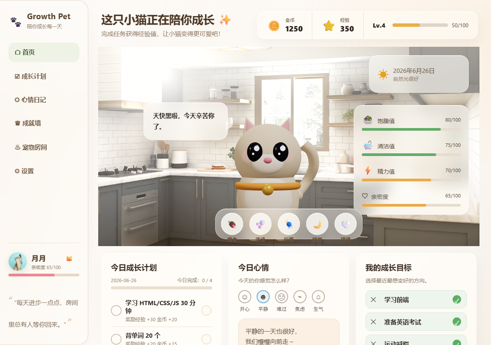

# Growth Pet · 成长陪伴宠物 🐾

> 养一只专属虚拟宠物，陪你完成每日目标 —— 把自律变成养成游戏。
> 纯原生 HTML / CSS / JavaScript，单文件，零依赖。

## ✨ 功能特性

- **完整养成闭环**：性格测试 → 匹配专属宠物 → 每日目标打卡 / 心情记录 / 商店 / 成就解锁
- **养成系统**：经验值与等级、宠物状态（饥饿 / 心情 / 能量）、升级弹窗、成就解锁
- **像素级视觉**：毛玻璃、多层渐变背景、复杂 Grid、keyframes 动画

## 🛠 技术栈

- 原生 **HTML5 / CSS3 / JavaScript**（无框架、无构建工具）
- `backdrop-filter` 毛玻璃 · 多层 `radial-gradient` · CSS Grid · `@keyframes` 动画
- 完整响应式（桌面 / 平板 / 移动端断点）

## 🚀 运行

直接双击 `index.html` 即可在浏览器打开，**无需安装任何依赖**。

## 📸 界面预览

