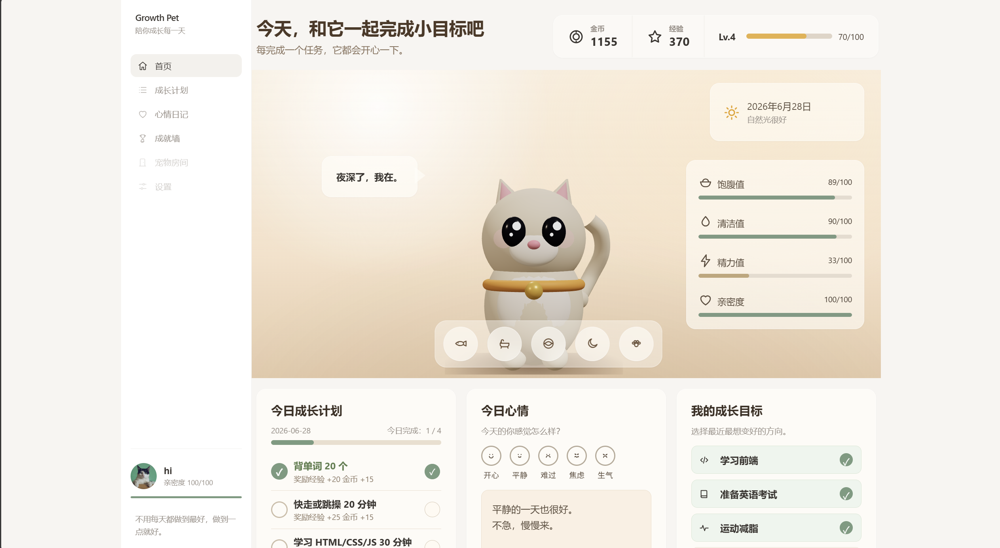

# Growth Pet · 成长陪伴宠物 🐱

> 养一只专属虚拟宠物，把每天的待办一点点变成养成 —— 让坚持小目标不再靠硬撑。

**在线体验**：<https://ovojiaa.github.io/growth-pet/> ｜ **技术栈**：原生 HTML / CSS / JavaScript + Three.js

---

## 这是什么

Growth Pet 是一个面向「想坚持却容易放弃」的人的**陪伴式习惯养成网页应用**。它把每日任务、心情记录和成长目标，包装成照顾一只虚拟宠物的过程——你完成任务，它就开心、升级、和你更亲近。

它不是待办清单的皮肤，而是一个**有完整状态、会随时间变化、像活的一样**的小生命。

## ✨ 核心功能

- 🧪 **性格测试领养**：5 题匹配 4 种专属宠物（猫 / 狗 / 兔 / 狐狸），也支持自选
- 🐱 **真 3D 小猫**：Three.js 实时渲染，会呼吸、眨眼、跟随鼠标转头、摇尾巴
- 📊 **实时状态系统**：饱腹 / 清洁 / 精力 / 亲密度，**按真实时间衰减**——关掉页面再回来，它也会饿、会困
- 🐾 **拟真行为**：吃饱了会拒绝、摸太多会烦、状态好时会自己嘀咕，像真猫一样有脾气
- 📅 **每日成长计划**：根据你选的成长目标（前端 / 英语 / 运动…）动态生成今日任务，完成即奖励经验与金币
- 🌤 **心情日记 + 成长目标**：记录情绪、选择想变好的方向，宠物会回应你
- 🏆 **成就系统 + 商店**：6 类成就解锁，金币可购买道具
- 💾 **本地存档**：localStorage 持久化，刷新不丢
- 📱 **完整响应式**：桌面 / 平板 / 移动端断点适配

## 🛠 技术栈

- **原生 HTML5 / CSS3 / JavaScript**（无框架、无构建工具；3D 部分使用 ES Module）
- **Three.js 0.160** —— 3D 渲染与动画
- **localStorage** —— 状态持久化
- CSS 变量设计 token · Grid 布局 · `backdrop-filter` 毛玻璃 · `@keyframes` 动画

## 🧠 技术亮点

<details>
<summary>点开看实现细节</summary>

1. **3D 渲染层与业务层彻底解耦**
   3D 小猫通过 `MutationObserver` 订阅 `#pet` 元素的 class（`happy` / `sleeping` / `blinking` / `bouncing`）和 `petArea` 的 CSS 变量（`--look-x` / `--look-y`）来驱动动画。业务逻辑完全不感知 3D 的存在——接入 3D 时一行业务代码都没改。

2. **真实时间衰减**
   状态不是每秒固定扣点，而是按 `lastTick` 时间差计算（`applyDecay`），跨刷新也能正确反映「离开期间宠物饿了多少」。睡觉时切换为回精力。

3. **拟真行为引擎**
   对话按优先级挑选：危急状态 > 当前时段 > 心情 > 亲密度 > 通用，并用 `recentSpeeches` 避免立即重复，让它显得真的在「想」。

4. **清晰的模块化结构**
   HTML / CSS / JS 三文件分离；3D 模块通过 `importmap` 加载 Three.js，与主逻辑互不耦合。

</details>

## 🚀 运行方式

**在线**：访问 [在线 Demo](https://ovojiaa.github.io/growth-pet/)

**本地**：

```bash
git clone https://github.com/ovojiaa/growth-pet.git
cd growth-pet
# 方式一：直接双击 index.html 即可运行
# 方式二：起本地服务器（3D 加载更稳）
python -m http.server
```

## 📁 项目结构

```
growth-pet/
├── index.html      # 页面结构 + 外部资源引用
├── style.css       # 全部样式
├── script.js       # 全部业务逻辑
└── assets/         # 静态资源
```

## 🗺 后续计划

- 🔌 **接入大模型**：让宠物对话与成长计划真正个性化（核心演进方向）
- ☁️ 后端 + 用户账户，支持多端同步
- 🐾 更多宠物种类与房间场景

## 📸 效果预览



---

独立开发 · 学习项目 · 持续迭代中
